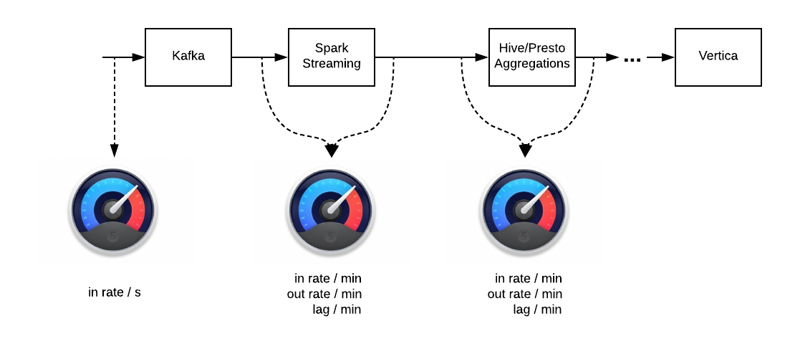
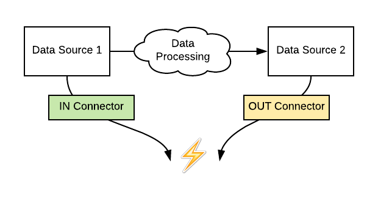
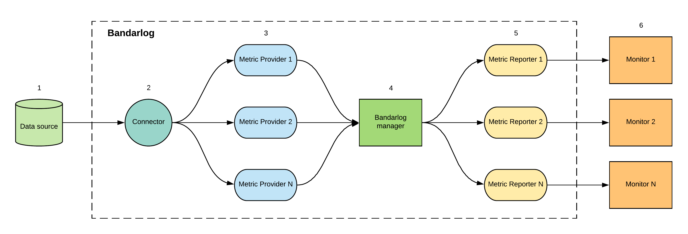

# Bandar-Log: Monitoring Tool
[](https://travis-ci.org/VerizonAdPlatforms/bandar-log)

<p align="center"></p>

<!--ts-->
   * [Intro](#intro)
   * [Why Bandar-Log?](#why-bandar-log)
   * [Getting started](#getting-started)
   * [Bandar-Log concepts](#bandar-log-concepts)
        * [Data source config](#data-source-config)
        * [Bandarlog](#bandarlog)
        * [Metric](#metric)
        * [Reporter](#reporter)     
   * [Architecture overview](#architecture-overview)
   * [Build custom image](#build-custom-image)
   * [License](#license)
   * [Credits](#credits)
<!--te-->

## Intro
Bandar-Log makes possible to monitor flow _throughput_ of data sources and processing components that are part of Data Ingestion and ETL pipelines. 

Typical ETL assumes having some processing logic between data sources which adds some delay i. e. "resistance", which should be measured. For example:
 * how many events Spark app process per minute and comparing to how many events come to Kafka topics
 * what's the size of unprocessed events in Kafka topics at this moment
 * how much time passed since the last aggregation processed

Collected metrics might be sent to specified monitoring service like [Datadog](https://www.datadoghq.com/) or others.


Typical ETL pipelines accept incoming data and compraises a chain of processing components with certain flow geometry:

1. There is incoming data with certain rate, we call it `IN`. 

   Examples: Kafka's topics that accept incoming messages.

2. There are ETL components that pull data from one data source and put it to another one. This consuming rate is called `OUT`. 

   Examples: Spark Streaming, Hive/Presto aggregations that pull portion of data from one table and aggregate it to another one, replicators that mirror data from one data source to another one.

Bandarlog is a standalone service that tracks `IN` [incoming rate], `OUT` [consuming rate] between two and more data sources. 

In addition, it allows to measure `LAG` which is defined as _(LAG = IN - OUT)_.

Particular semantics of metrics `IN, OUT, LAG` depends on specific Data Sources and contracts that Bandarlog expects (see [Metrics](#metrics)).

## Why Bandar-Log?
1. Easy to use. Create your own Bandar-Log in 10 minutes, just follow up with [Start Bandar-Log in 3 steps](samples/README.md) section.
2. Tested on the real-time big data pipelines for a long period of time. Bandar-Log proved itself like the most straightforward and stable component.
3. Support. Bandar-Log is running right now. So, we care about its stability and new features.
4. No need to modify any apps. Bandar-Log is a separated application which monitors metrics outside.
5. Easy to extend and add custom data sources.

## Getting Started
See How to [Start Bandar-Log in 3 steps](samples/README.md).

## Bandar-Log concepts
 * Data source config
 * Bandarlog
 * Metric
 * Reporter
### Data source config
`Data source` is an abstration over persistance component which can provide or store data. 

In Bandar-Log data source is represented by configuration object called `data source config`.

`Data source config` specifies driver/connection properties like host, username, password etc... `Data source config` can be shared between multiple `data sources`.

#### Kafka data source
_Kafka data source configuration:_
```
kafka-config {                   # kafka configuration id (can be any id)
  brokers = null                 # default list of brokers, currently is disabled and taken from zookeeper
  zk-quorum = "1.1.1.1:2181"     # zookeeper servers
}

example-bandarlog {
  connector = "kafka-config"     # reference to the particular kafka config
}
```

#### SQL data source
_SQL data source configuration:_
```
sql-data-source-config {             # data source configuration id (can be any id)
  host = "example.host.com"          # data source host
  port = "5433"                      # data source port
  dbname = "dbname"                  # data source database name
  username = "username"              # data source username
  password = "password"              # data source password 
  schema = "schema"                  # data source schema  
  use-ssl = true                     # data source SSL mode flag (by default = true)
  max.pool.size = 10                 # connection pool size (by default = 10) 
  connection.timeout.ms = 60000      # connection timeout in ms (by default = 60000)
}

aws-glue-source-config {
  region = "region"                  # aws region
  dbname = "database"                # database name
  access.key = "accesskey"           # access key provided by AWS account
  secret.key = "secretaccesskey"     # secret key provided by AWS account
  fetch.size = 10                    # the maximum number of partitions to return in a single response
  segment.total.number = 10          # the total number of segments - non-overlapping region of a table's partitions. Maximum possible value - 10
  maxwait.timeout.seconds = 60       # maximum wait time until all the parallel requests become completed
}
```

#### Supported data source versions:
   - Kafka _(version >= 0.10.2)_
   - SQL
        - Vertica _(compatible with vertica driver 6.0.0)_
        - Presto _(compatible with presto driver 0.181)_
        - AWS Glue Data Catalog _(compatible and tested with aws-java-sdk-glue 1.11.388)_ <br/>
        `*` you can easily add new data source

### Bandarlog
`Bandarlog` -- unit of data-flow monitoring for one data source or between several data sources. <br/>
Each `bandarlog`, depending on its type, has one or multiple `connectors` -- objects that reference to specific `data source config`. Bandarlog monitors flow between linked data sources.

For now there are two supported bandarlog types:
 * SQL -- to measure the performance of specific ETL component(s) which reads data from SQL-complient data source and writes data to SQL complient data source(s). In order to use Glue connector, one needs metadata table, for example, created by the AWS Glue crawlers. Crawlers connect to a source or target data store, determine the schema, automatically compute statistics and register partitions, and then create metadata table in the AWS Glue Data Catalog.
 * Kafka -- to measure performance of specific kafka consumer and incoming rate.


SQL connectors divided into `IN` and `OUT` connector types with **_one-to-many_** relation _(we can have one `IN` connector and several `OUT` connectors)_:

<p align="center"></p>  

`IN` - connector for _input_ data source. `IN` metric will be fetched from it _(input rate)_. <br/>
`OUT` - list of connectors for _output_ data sources. `OUT` metrics will be fetched from it _(output rate)_. <br/>   
      
You can use `IN` or `OUT` connector separately according to your requirements _(like in [quick start examples](samples/README.md))._   

_SQL connector configuration:_
```
in-connector {                               
  type = "presto"                   # data source type (vertica, presto)
  config-id = "presto-config"       # reference to the data source config id
  tag = "presto-tag-name"           # reporting tag value
}
out-connectors = [{                         
  type = "vertica"                  # data source type (vertica, presto)
  config-id = "vertica-config"      # reference to the data source config id
  tag = "vertica-tag-name"          # reporting tag value
}]

```

Bandar-Log App accepts list of `bandarlog` units that works in parallel.
One Bandar-Log App instance can run all required stuff. <br/>

```
bandarlogs {               # bandarlogs list, every bandarlog should be inside it (can't be renamed)
    <bandarlog-1> {        # bandarlog unit (can be renamed to any name)
        ...
    }
    ...
    
    <bandarlog-n> {
        ...
    }
}
```

Bandarlogs are isolated therefore any connection/semantics issues affected one bandarlog won't affect others.

Each bandarlog has several mandatory properties: <br/>
1. **Enabled** - flag to enable/disable bandarlog unit 
```
enabled = true
```
2. **Bandarlog type** - can be `kafka` or `sql` according to data source
```
bandarlog-type = "kafka"
```
3. **Column type** - for `sql` bandarlog (see [SQL](#sql) section).
```
column-type = "timestamp"
```
4. **Data source & Connector** - see [Data sources](#data-source-config) section.

5. **Metrics** - list of metrics which are should be calculated and reported (see [Metric](#metric)).
```
metrics = ["IN", "OUT", "LAG"]    
```
6. **Reporters** - see [Reporter](#reporter) section.

7. **Scheduler** - specifies bandarlog execution time
```
scheduler {                                         
  delay.seconds = 0              # delay in seconds before bandarlog is to be executed
  scheduling.seconds = 60        # time in seconds between bandarlog executions
}
```
8. **Tables/Topics** _(according to the bandarlog type)_ - each metric will be calculated and reported for each table/topic from the list. <br/>

_SQL tables:_
```
tables = [  
  {                                                        # config for table when column-type = datetime
    in-table = "in_table"                                  # table name for for the IN metric
    in-columns = ["year=yyyy", "month=MM", "day=dd"]       # <column>=<format> pairs for the IN metric
    out-table = "out_table"                                # table name for for the OUT metric
    out-columns = ["year=yyyy", "month=MM", "day=dd"]      # <column>=<format> pairs for the OUT metric
  },
  {                                                        # config for table when column-type = timestamp
    in-table = "in_table"                                  # table name for for the IN metric
    in-columns = ["in_column"]                             # column name for the IN metric
    out-table = "out_table"                                # table name for for the OUT metric
    out-columns = ["out_column"]                           # column name for the OUT metric
  },                                    
  {                                                        # config for table when column-type = default
    in-table = "in_table:in_column"                        # <table>:<column> pair for the IN metric
    out-table = "out_table:out_column"                     # <table>:<column> pair for the OUT metric
  },
  ...
]
```
_Kafka topics:_
```
topics = [                                        
  {
    topic-id = "topic_id"                     # user-friendly topic id, every metric will be tagged with this value
    topic = ["topic_1", "topic_2"]            # kafka topics
    group-id = "group_id"                     # kafka group id
  },
  ...
]
```

### Metric
Bandar-Log measures three fundamental metrics `IN, OUT, LAG` whose semantics depends heavily on `bandarlog-type` _(kafka, sql)_.
`Bandarlog` object contains section `metrics` to specify either all of them or just required subset.

```
metrics = ["IN", "OUT", "LAG"]
```

#### Kafka
> **Note**
>
> Bandar-Log assumes that Kafka consumer component that require to me monitored, commit their offsets back to Kafka using [Kafka API](https://github.com/apache/spark/blob/master/external/kafka-0-8/src/main/scala/org/apache/spark/streaming/kafka/KafkaCluster.scala#L307).

The following metrics are available for `bandarlog` with type `kafka` :

| Metric | Reporting metric name | Value type | Required params | Description |
| :---: | :---: | :---: | :---: | :---: |
|`IN`|`*.in_messages`| incoming messages (long)|`topic`| Number of incoming messages across all topic partitions calculates as SUM of leader offsets `**` for all topic partitions fetched from [Kafka API (getLatestLeaderOffsets)](https://github.com/apache/spark/blob/master/external/kafka-0-8/src/main/scala/org/apache/spark/streaming/kafka/KafkaCluster.scala#L155) <br/> using `topic` from `topics` list|
|`OUT`|`*.out_messages`| consumed messages (long)|`topic`, `group-id`| Number of consumed messages across all topic partitions calculates as SUM of consumer offsets `**` for all topic partitions fetched from [Kafka API (getConsumerOffsets)](https://github.com/apache/spark/blob/master/external/kafka-0-8/src/main/scala/org/apache/spark/streaming/kafka/KafkaCluster.scala#L239) <br/> using `topic` and `group-id` from `topics` list|
|`LAG`|`*.lag`| unconsumed messages (long)|`topic`, `group-id`| Number of unconsumed messages, calculates as Sum(leader offsets - consumer offsets) `**` per topic |

`*` reporting prefix <br/>
`**` according to kafka architecture, **offset** is an order of messages

#### SQL
> **Note**
> 
> Bandar-Log assumes:
> 1. ETL components use dedicated column(s) to mark and isolate specific piece of processed data. 
> 2. Column can be of several types according to data type of partition column: `default` or `timestamp` or `datetime`. 
> 2. The semantics of `default`/`timestamp` column (here and futher called  `batch_id` [name is configurable]) is Unixtime timestamp measured in milliseconds (_UTC_ by definition) which determines a moment of time when piece of data has been processed. `default` is used for compatibility with previous version of BandafLog and will be deprecated
> 3. This column must be fetched using query `SELECT MAX(batch_id) FROM :table`.
> 4. The semantics of `datetime` is Date/Timestamp (e.g., '2013-01-01' or '2015-04-09 14:07'). There can be several columns of type `datetime`. Along with the column name the appropriate format must be provided via config for parsing the partition values to date represented by milliseconds. The format is according to [Date and Time Patterns](https://docs.oracle.com/javase/8/docs/api/java/text/SimpleDateFormat.html) in Java SimpleDateFormat.
> 5. These columns must be fetched using query `SELECT DISTINCT year, month, day FROM :table`
> 6. In case of the AWS Glue connector, a dedicated column (for example, batch_id) should be a partition column. Thus, having a metadata table generated by AWS Glue crawler, Glue client can extract maximum value
     for partition column without the need for scanning the whole table in AWS Athena.
> 
>   _(for presto with **optimize_metadata_queries=true** connection setting)_

The following metrics are available for `bandarlog` with type `sql` :

| Metric | Reporting metric name | Value type | Required params | Description |
| :---: | :---: | :---: | :---: | :---: |
|`IN`|`*.in_timestamp`| timestamp (long)| `in-table` | Timestamp fetched from `in-connector` data source using `<table>:<column>` <br/> pair from `in-table` property |
|`OUT`|`*.out_timestamp`| timestamp (long)| `out-table` | Timestamp fetched from `out-connectors` data sources using `<table>:<column>` <br/> pair from `out-table` property |
|`LAG`|`*.lag`| diff in milliseconds (long)| `in-table`, `out-table` | Difference between `IN` and `OUT` timestamps _(LAG = IN - OUT)_ |
|`REALTIME_LAG`|`*.realtime_lag`| diff in milliseconds (long)| `out-table` | Difference between current timestamp in UTC and `OUT` timestamp _(REALTIME_LAG = <br/> System.currentTimeMillis() - OUT)_ |

`*` reporting prefix <br/>

### Reporter
Reporter API for the specific monitoring service like Datadog. <br/>

_Reporters configuration:_
```
report {                                           # each metric will be reported using these properties
  prefix = "vertica_metrics"                       # report prefix which should be used for reported metrics (kafka_metrics.in_messages..)
  interval.sec = 180                               # reporter running interval
}    

reporters = [                                      # list of reporters, where each metric should be reported
  {
    type = "datadog"                               # reporter type
    config-id = "datadog-config"                   # reference to reporter config
  }
]
```

#### Datadog
Currently, we are using Datadog reporter as a single reporter for bandarlog metrics. <br/>
Inside datadog reporter configuration you can specify host, metrics prefix and running interval for datadog reporter. <br/>
Also, we are using Datadog tags to keep metrics data aggregated, look at [Reporting Tags](#reporting-tags) section for more details.

_configuration:_
```
datadog-config {                      # datadog reporter config id
  host = null                         # use 'null' to use local datadog agent or specify host value  
}
```

#### Reporting Tags
Tags are a way of adding dimensions to metrics, so they can be sliced, aggregated, filtered.

##### Default Tags 

###### Kafka
| Metric | Tags |
| :---: | :---: |
|`IN`|`topic:<topic-id>`|
|`OUT`|`topic:<topic-id>`, `group-id:<group-id>`|
|`LAG`|`topic:<topic-id>`, `group-id:<group-id>`|

`*` `<topic-id>` and `<group-id>` are placeholders for topic values from `topics=[...]` list inside kafka bandarlog config

###### SQL
| Metric | Tags |
| :---: | :---: |
|`IN`|`in_table:<in-table>`, `in_connector:<in-connector>`|
|`OUT`|`out_table:<out-table>`, `out_connector:<out-connector>`|
|`LAG`|`in_table:<in-table>`, `in_connector:<in-connector>`, `out_table:<out-table>`, `out_connector:<out-connector>`|
|`REALTIME_LAG`|`out_table:<out-table>`, `out_connector:<out-connector>`|

`*` `<in-table>` and `<out-table>` are table placeholders from `tables=[...]` list inside sql bandarlog config. <br/>
`<in-connector>` and `<out-connector>` are placeholders from `tag` value inside in/out connector config. 

###### Environment Tag
`env:<environment>` <br/>
`<environment>` value will be fetched from `APP_ENVIRONMENT` variable if it does not exist - the tag will not be reported.

##### Custom Tags
You can specify your own reporting tags, just add the following config to your bandarlog with a required key-value pair.
```
bandarlogs {
  example-bandarlog {
    ...
    tags = [
      {
        key = "<tag_name>"
        value = "<tag_value>"
      }
    ]
    ...
  }
}
```
 
## Architecture overview


1. **Data source** <br/>
Kafka, Vertica, Presto, AWS Glue Data Catalog. 
2. **Connector** <br/>
API layer over data source. <br/>

3. **Metric Provider** <br/>
Metric Provider calls connector API to fetch data from data source and calculates specific business metrics based on it.
Each metric has appropriate metric provider accordingly to `bandarlog-type`. <br/> 
For example `IN` metric for `bandarlog-type = "kafka"` will use `KafkaInMessagesProvider` but for `bandarlog-type = "sql"` it will use `SqlTimestampProvider`.

4. **Bandarlog manager** <br/>
Bandarlog is a monitoring unit for one or several data sources which is responsible for the managing data providers and reporters.

5. **Metric Reporter** <br/>
Reporter API for the specific monitoring service like Datadog. <br/>

6. **Monitor** <br/>
Metrics monitor in monitoring service.

## Docker image

Published as [bandarlog](https://hub.docker.com/r/onebyaol/bandarlog/)

## Build custom image

_publish bandarlog image to the local machine:_
```
sbt bandarlog/docker:publishLocal
```

_push image to docker registry:_
```
docker login -u <docker_user> -p <docker_password> <docker_registry>
docker push <image>
```

## License
Bandar-Log is released under the Apache License, Version 2.0

## Credits
 * [Alexey Lipodat](mailto:a.lipodat@gmail.com)
 * [Denis Pyshev](mailto:denys.pyshev@verizonmedia.com )
 * [Alexey Kotlyar](mailto:kotlyar.alexey@verizonmedia.com)
 * [Boris Trofimov](mailto:trofimov.boris@verizonmedia.com)
 * [Maria Rabyk](mailto:mariia.rabyk@sigma.software)
 * Jorge Pedret for cute [Bandar-Log's face](doc/images/monkey.png) 
 
