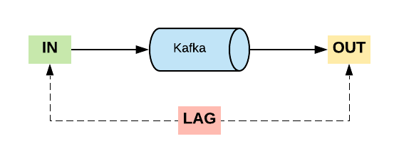
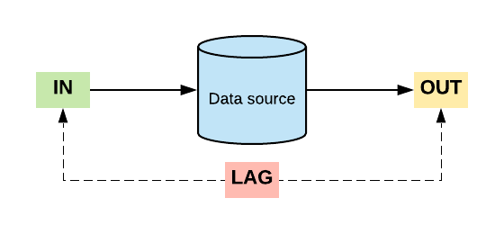
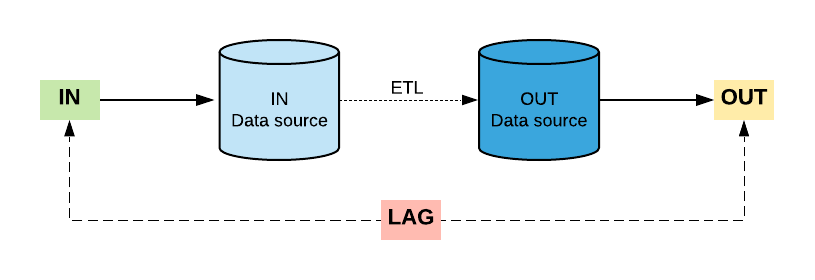
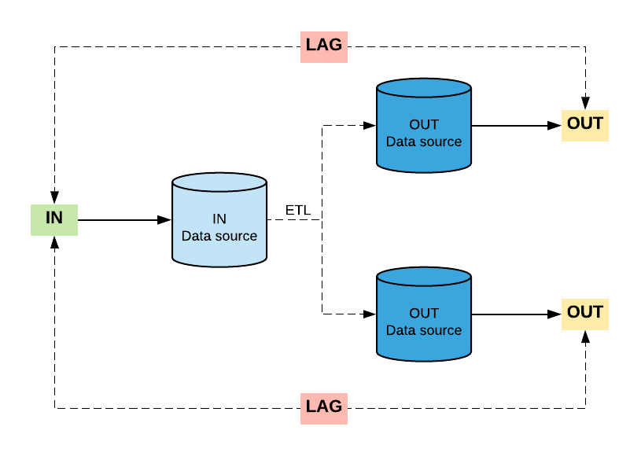
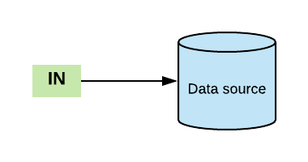
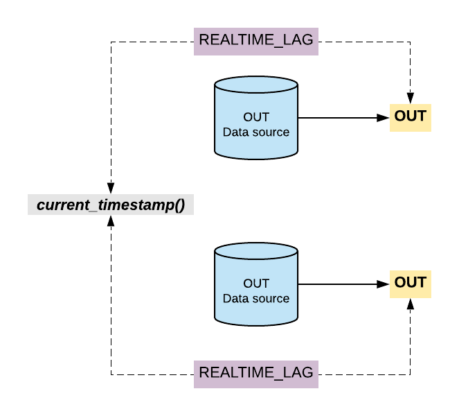

# Start Bandar-Log in 3 steps!

1. Check [Prerequisites](#prerequisites) section and prepare environment.
2. Choose one of the config templates according to your purposes (see [Config templates](#config-templates))
3. Run docker Bandar-Log image with config file (see [How to run?](#how-to-run) and [Program arguments](#program-arguments))

## Prerequisites
- JDK 1.8
- Docker

## How to run?
**_with http[s] path to config:_**
```
docker run --name bandarlog --config-path "https://path.to.config/application.conf"
```
**_with local path to config:_**
```
docker run --volume=/config/path:/config/path --name bandarlog --config-path "/config/path/application.conf"
```
**_with consul path to config:_**
```
docker run --name bandarlog --config-strategy consul --consul-host consul.host.com --consul-path consul/path/application.conf
```
`*` also you can specify `--consul-port 8500` property if you are using overridden port number

**_with config from app resources:_**
```
docker run --name bandarlog --config-strategy resources
```
`*` use environment variable `APP_ENVIRONMENT` to specify resources folder _(`APP_ENVIRONMENT=prod`, will get resources from `prod/application.conf`, by default will be just `application.conf`)_

## Program arguments
| Name | Default value | Possible values | Description |
| :---: | :---: | :---: |  :---: | 
|`--config-strategy`| `path` | `consul`, `path`, `resources` | config source strategy determinate config source <br/> which should be used to get an `application.conf` file|
|`--config-path`| - | http[s]://path.com/application.conf, /<some_path>/application.conf| specifies URL or local path <br/> to the application.conf file `*`|
|`--consul-host`| - | http[s]://consul.host| consul host parameter `**`|
|`--consul-port`| `8500` | any valid consul port number | consul port number `**`|
|`--consul-path`| - | path to the consul config in the format: `path/key` | consul path to the config file `**`|

`*` used with `--config-strategy path` parameter <br/>
`**` used with `--config-strategy consul` parameter


## Config templates
Use one of the config templates according to your data sources architecture.

### Kafka
Kafka bandarlog config for base Kafka metrics: `IN` _(input messages)_, `OUT` _(output messages)_ and `LAG` _(diff between IN and OUT)_ metrics. <br/>

_schema:_
<p align="center"></p>

_config:_ [application.conf](config-examples/kafka/application.conf)


### SQL

#### Single data source
Use this config template if you need to track stats for a single data source. It can be single data source with different tables for `IN` _(in-table)_ and `OUT` _(out-table)_ metrics. <br/>

_schema:_
<p align="center"></p>

_config:_ [application.conf](config-examples/sql/single-datasource/application.conf)


#### IN and OUT data sources
If you are using several data sources in ETL pipeline, this type of config is nice option to track the state of whole pipeline data sources. `IN` metric will be fetched from IN data source/connector, `OUT` metric from OUT data source/connector and `LAG` metric will be calculated between them.
Also, you can add `REALTIME_LAG` metric to metrics list to get the difference between current timestamp and timestamp metric from `OUT` data source. <br/>

_schema:_
<p align="center"></p>

_config:_ [application.conf](config-examples/sql/in-and-out-datasources/application.conf)


#### One IN and several OUT data sources
Like in config type above, this type of config is nice option to track the state of several data sources if you have one IN and several OUT data sources. <br/> 

_schema:_
<p align="center"></p>

_config:_ [application.conf](config-examples/sql/one-in-and-several-out-sources/application.conf)


#### Only IN data source
Simple config if you want to track just `IN` metric. <br/>

_schema:_
<p align="center"></p>

_config:_ [application.conf](config-examples/sql/only-in-datasource/application.conf)


#### Only OUT data sources
This configuration is for cases if you want to track `OUT` and `REALTIME_LAG` metrics from several data sources _(or single, you can specify just one data source)_. 

_schema:_
<p align="center"></p>

_config:_ [application.conf](config-examples/sql/only-out-datasource/application.conf)
